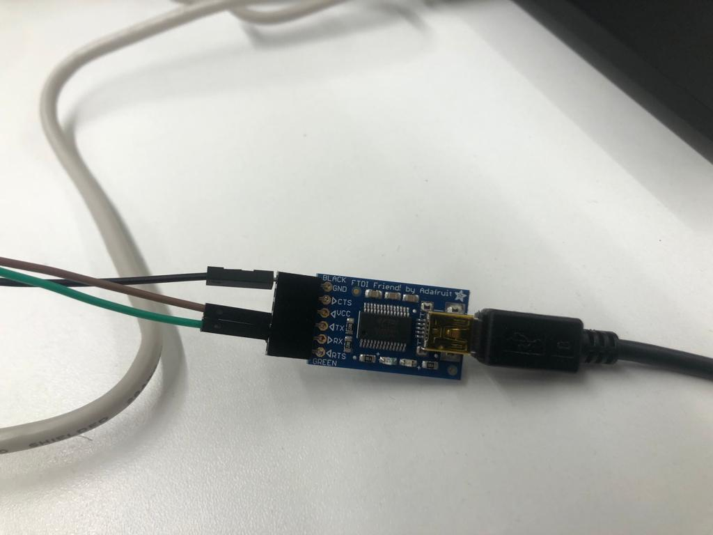

# Processador RISC-V na FPGA

- **Alunes:** Luis Filipe Carrete
- **Curso:** Engenharia da Computação
- **Semestre:** 7
- **Contato:** luisfsc@al.insper.edu.br
- **Ano:** 2022

## Começando

Para seguir esse tutorial é necessário:

- **Hardware:** DE0-C, FTDI Friend by Adafruit, 2 Jumpers Macho Femea e 1 Macho Macho
- **Softwares:** Quartus 18.01 Funcionando (Com o USB Blaster funcional)
- **Código Fonte:** [Arquivos VHDL utilizados](https://github.com/emb4fun/neorv32-examples)
- **Exemplos de códigos:** [Exemplos de códigos em C para testar na RISCV](https://github.com/stnolting/neorv32)

## Motivação

Expliquem porque quiseram fazer esse tutorial.

RISC (Rapid Instruction Set Computer) é uma arquitetura de processador, desenvolvida em 1981 na Universidade da Califórnia, Berkeley. Ela foi criada com a intenção de simplificar instruções individuais enviadas ao processador para resolver uma certa tarefa. Esse modelo foi criado para funcionar em contraste a arquitetura CISC (Complex Instruction Set Computer) que contém instruções mais robustas. Ou seja, uma instrução de uma arquitetura CISC faz muito mais que uma instrução do RISC, por isso um código para a arquitetura RISC tende a ser muito maior que um código para arquitetura CISC. Apesar disso, a arquitetura RISC tem como vantagem reduzir o tempo de processamento de cada instrução, pois as instruções são muito mais simples, ele utiliza estratégia de criar um pipeline no processador para que ele possa rodar múltiplas instruções em paralelo. 

O RISC V é a quinta versão que hoje está com alta demanda no mercado com um [crescimento de 36.9% de 2021 - 2022](https://riscv.org/blog/2022/02/semico-researchs-new-report-predicts-there-will-be-25-billion-risc-v-based-ai-socs-by-2027/#:~:text=Semico%20Research%20forecasts%20that%20RISC,more%20traditional%20CPU%20SIP%20types), e com previsão de 34.9% de crescimento no mercado até 2027 resultando em uma receita esperada de $291 bilhões de dólares no mesmo ano. Isso é resultado de grandes empresas optarem pelo RISC em vez de processadores tradicionais. Com isso em mente, fica claro a importância desta arquitetura em nosso cenário atual.

----------------------------------------------

# Iniciando o tutorial

## Clonando o repositório

Para iniciar o projeto a primeira coisa a ser feita é clonar o [repositório](https://github.com/emb4fun/neorv32-examples) , que contem o VHDL e todo código necessário para compilar um processador RISC V para a sua DE0-CV, para a sua máquina local.

Como podemos ver após o clone existem diversos diretórios onde cada um deles seria o código compatível com placas específicas, para mais informações ler o readme do repositório. No nosso caso como nossa placa é a DE0-CV iremos focar somente neste diretório. 

## Compilando 

Agora basta abrir o quartus, selecionar Abrir Projeto e selecionar o arquivo com extensão .qpf no diretório \de0-cv\de0cv-neorv32-sdram-qsys\hw. Após isso, agora só resta conectar a placa com a sua máquina local e apertar o botão de play azul para compilar o programa para a placa.

Caso os passos acima forem feitos com êxito podemos ir para a segunda parte.

## Passando para a DE0-CV

Agora que conseguimos criar e compilar o código devemos passá-lo para a placa. Como utilizaremos comunicação UART para transferir o binário, precisamos acrescentar algumas conexões físicas à nossa placa. No nosso caso utilizaremos a plaquinha FTDI friend para ser o homem do meio em nossa comunicação. Vamos conectá-la a nosso computador via USB, vamos agora pegar nosso jumper Macho Macho e conectar o ground da FTDI com o ground da CE0-CV. Agora pegamos os dois jumpers macho fêmea e vamos conectar um deles no pino TX da FTDI com o pino GPIO_1_D29 da DE0-CV e o outro jumper no pino RX da FTDI com o pino GPIO_1_D28 da DE0-CV. Assim nosso hardware está pronto para a transferência.

A montagem deve estar igual a imagem a baixo:

{width=500}
{width=500}   

## Abrindo 
!!! info 
    Essas duas partes são obrigatórias no tutorial:
    
    - Nome de vocês
    - Começando
    - Motivação

## Recursos Markdown

Vocês podem usar tudo que já sabem de markdown mais alguns recursos:

!!! note 
    Bloco de destaque de texto, pode ser:
    
    - note, example, warning, info, tip, danger
    
!!! example "Faça assim"
    É possível editar o título desses blocos
    
    !!! warning
        Isso também é possível de ser feito, mas
        use com parcimonia.
    
??? info 
    Também da para esconder o texto, usar para coisas
    muito grandes, ou exemplos de códigos.
    
    ```txt
    ...
    
    
    
    
    
    
    
    
    
    
    
    oi!
    ```
    
- **Esse é um texto em destaque**
- ==Pode fazer isso também==

Usar emojis da lista:

:two_hearts: - https://github.com/caiyongji/emoji-list


```c
// da para colocar códigos
 void main (void) {}
```

É legal usar abas para coisas desse tipo:
    
=== "C"

    ``` c
    #include <stdio.h>

    int main(void) {
      printf("Hello world!\n");
      return 0;
    }
    ```

=== "C++"

    ``` c++
    #include <iostream>

    int main(void) {
      std::cout << "Hello world!" << std::endl;
      return 0;
    }
    ```

Inserir vídeo:

-  Abra o youtube :arrow_right: clique com botão direito no vídeo :arrow_right: copia código de incorporação:

<iframe width="630" height="450" src="https://www.youtube.com/embed/UIGsSLCoIhM" frameborder="0" allow="accelerometer; autoplay; clipboard-write; encrypted-media; gyroscope; picture-in-picture" allowfullscreen></iframe>

!!! tip
    Eu ajusto o tamanho do vídeo `width`/`height` para não ficar gigante na página
    
Imagens você insere como em plain markdown, mas tem a vantagem de poder mudar as dimensões com o marcador `{width=...}`
    


{width=200}
